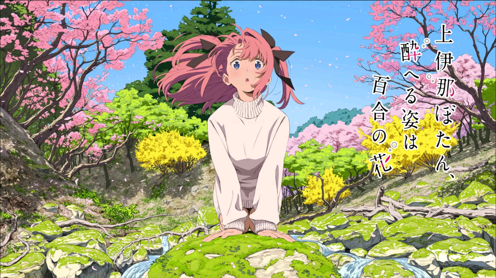
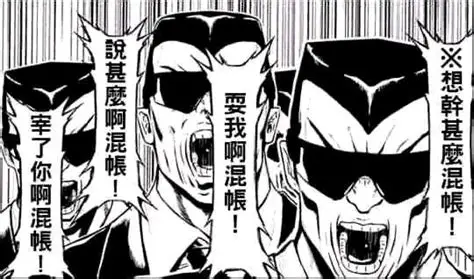
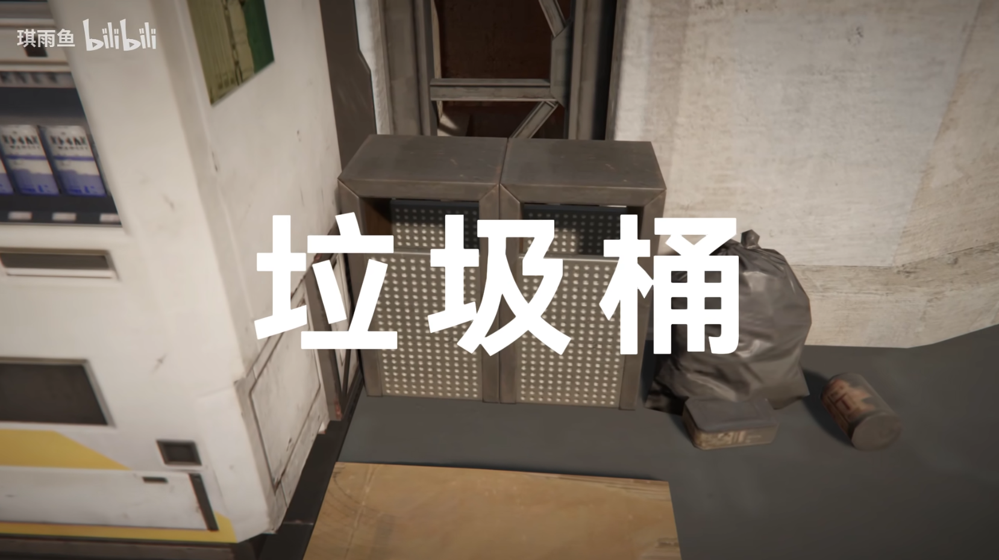

<figure>

<figcaption>

图片出自TV百合动画《上伊那牡丹，酒醉身姿似百合花般》

</figcaption>

</figure>

---
### 博客搬家

我最开始自己搭个人博客的时候什么都不懂，是照着一个B站教程一步步搭建的(→ [超详细！个人博客搭建教程，低成本，零代码，手把手，WordPress](https://www.bilibili.com/video/BV1ac411B7Li) ),流程也比较简单，就是虚拟主机租赁、域名购买、WordPress安装这几步而已

这种方式很快就遇到了几个严重的问题，一个是访问速度太慢，另外一个是我的存储空间快要捉襟见肘了

我完全按照视频教学流程，租了一个虚拟主机而不是云服务器，如果说租VPS是在网上租房，租虚拟主机就是在一个房间里面租了个衣柜。我只有500mb的网页存储空间——WordPress和它臃肿的插件，每篇文章里面再放几张高清图片，已经快要把这个衣柜塞满了。访问太慢的原因主要是4mbps的带宽限制，以及由于虚拟主机的多人合租性质，一个物理服务器上的所有虚拟主机共享CPU和内存，意思就是可能有很多人在同时从这个房间里面拿衣服，但是不是所有人都能第一时间站在衣柜前

实际上，用WordPress动态站方案搭建个人博客，完全是性能过剩，并且不算是现代开发者搭建博客的主流架构，这是我之后才逐渐明白的

<figure>

<figcaption>

</figcaption>

</figure>

个人博客是以文字和图片为主要载体的个人表达(~~可能有些博客连图片都不需要~~)，不需要很多花里胡哨的功能，用静态站实现是最合适的

简单解释一下二者的区别

WordPress为主的动态站，实际上是把数据打散了存储到数据库里面的，Web服务器(Nginx)收到的请求，转发给PHP-FPM进程，PHP解释器进行URL解析判断访问者请求的页面，是主页还是文章等等，然后进行激烈的查询，执行php主题和html拼接，最后把拼出来的完整html交给浏览器渲染，如果用做菜打比方，后端处理每一次访问都要从头开始执行一次烧油炒菜的全套流程，这不仅耗费大量时间，而且对于个人博客来说完全没必要

VitePress的静态站实现，就是端上来预制菜，在文本编辑器里面用md语法写出来的文章，被markdown-it解析为抽象语法树，再由VitePress编译为Vue组件的渲染函数,Vite打包压缩后，生成预渲染的HTML文件，附带所需的JS和CSS资源，CDN接收到请求后直接返回静态文件，首屏加载远远快于动态站

静态站部署在Vercel上也不需要担心存储空间问题，更重要的是，Vercel部署是完全免费的

所以WordPress的工作流程其实有点花冤枉钱，搭建静态站根本不需要花租虚拟主机和买域名的钱(不过我挺喜欢自己挑的域名)，顺带一提，域名申请有几率碰上IP所在地与户籍所在地不符，导致审核不通过的情况，我个人是在寒假回家期间租的，运气好没遇到什么阻碍

---
### 新家装修

新站点什么都很好，就是外观不尽人意，现有的定制化主题中，并没有非常舒适的二次元主题

<figure>

<figcaption>

南无三，二次元主题，实则美丽！ 

</figcaption>

</figure>

之前的架构用的是WordPress下的Sakura主题 GitHub地址 <https://github.com/mashirozx/Sakura>，Sakura和Sakurairo主题提供了非常全面且周到的服务，不过我基本上没用到，只是觉得很好看

我去找了一下VitePress下有没有类似的主题，很遗憾，二次元主题在极客风格站点下被评为不通过，基本上没什么萌萌的优秀主题，不过我还是找到了一个VitePress下的Sakura主题移植，GitHub地址 <https://github.com/flaribbit/vitepress-theme-sakura>

这个仓库的最后一次commit是在2024年，作者flaribbit已经很久没有维护过这个项目了，而且也有很多没完全移植过来的内容，但是还是非常感谢他的贡献

我把这份源码clone到本地，然后在他的工作基础上，开始了自己的改造

---
### 轰轰烈烈的主题大改造

主题相关代码在博客文件夹根目录下的.vitepress/theme 里，由多个以.vue为后缀的SFC单文件组件共同实现

组件化思想是一种降低网页代码耦合度的方式，Vue3的组件逻辑上和编程语言里的函数有相似之处，组件各自实现负责的功能，拼装在一起完成整体界面的展示，内部代码封装，一个组件的样式和逻辑不会意外污染其他组件的内容，父与子之间通过属性传递机制实现沟通

以本主题的架构为例，Layout.vue是页面渲染的全局指挥，HTML里面的`<Header />`负责导航栏，而导航栏内部的实现由import Header from './Header.vue'导入Header内部的方案，就算Header写崩了，也不需要修改Layout的内容。不过如果一个SFC组件有严重错误，VitePress的构建会出错，就像函数内部的语法错误会导致编译不通过一样

事实上，这些工作的绝大部分内容是由deepseek-v4-pro和claude code实现的，所以我不会写如何实现个人风格或者如何微调CSS，只会选择我自己觉得有意思或者有价值的部分讲一讲

**首页：**

首页标题其实是Neta终末地的无衬线白字演出

<figure>

<figcaption>

图片来自 [终末地白字，但是莫名其妙](https://www.bilibili.com/video/BV1k2ZHBCEK1)

</figcaption>

</figure>

我感觉这个还挺帅的，不过如果完全还原的话，应该只写上去两个字“博 客”
想了想好像有一种简约又直白的美

字体是"HarmonyOS Sans"，终末地中使用的字体，也是博客所有文字使用的默认字体

sakura主题的话，首页中间会有一个缓慢旋转的博主头像，说实话我不是很喜欢这个设计，感觉很土，我这里把头像放在导航栏了，导航栏的设计完全照搬了sakura主题的方案

**文章列表：**

sukura主题里面，每次会在一个图片池里面随机抽取几张图，作为首页背景图或者文章列表的展示图

我很喜欢给每篇文章安排一个头图，大部分是取自我写这篇文章期间在看的动画，所以我把这部分内容写到了主题里面

每篇文章都有一个head,包括标题，作者，日期，封面，元素和摘要，这些内容会展示在文章列表和正文界面

