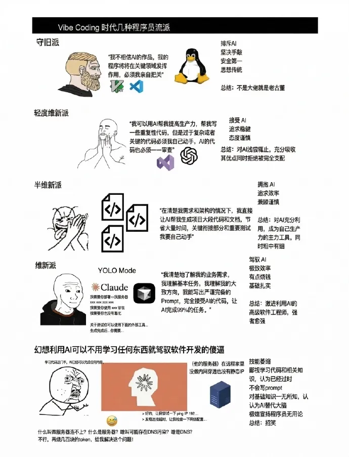

_本文内容仅为个人的学习体会与浅见，如有疏漏或不妥之处，欢迎在评论区批评指正_

文章主要知识体系基于同济大学《高级语言程序设计》的授课内容，对于部分知识进行了梳理，以及使用更加平易近人的叙述  
个人观点，高程和工科三大基础数学（高数、线代、概率论）都是在以后的学习工作中会大范围使用的重要课程，书写本文的主要目的，是让笔者更加深刻的理解编程基础知识，如果有读者在阅读过程中有所收获则再好不过

这篇文章是系列第一篇内容，不会有太多实质性的知识，但是会对一些学习中的常见问题进行解答，算是写在最前的课程导入

### 学习编程让人很难受——但是用AI很舒服

这很正常

我不会在这里讲什么要吃学习的苦的道理，这种话我相信各位高中就听够了

相信很多人关心的是：**学习编程时候的AI到底应该使用到什么程度？**

有些人可能是拿到作业ppt就直接Ctrl+C、Ctrl+V喂给豆包，豆女士写的代码直接看也不看塞进编译器，跑出来之后看到跟demo的结果差不多就提交，稍微认真一点的可能会和demo做一下比对，然后把代码复制到对话框里，给demo生成的txt截一个图，然后告诉豆包我要这个截图里面的结果，给我改一下代码

那完蛋了

当然如果肯花钱找大作业代写的话，期末考试还是能过的，不过这种学法也可以正式和编程告别了  
如果有人看到这篇文章恍然大悟还能找大作业代写，那也算是指点迷津

相对合理一点是看到题目要求先思考一个方案，这里用什么样的结构能解决问题。  
然后尝试从零开始手搓，当然写出来的代码可能甚至有语法错误（很多老鸟也会手滑），遇到编译器报错不要直接让AI去debug，在搜索引擎里面复制输出日志看一下这是什么问题，自己去搜比让ai帮你搜留下的印象深刻的多。  
然后会遇到逻辑问题导致输出的内容与目标相去甚远，这个时候最好也是自己去一行一行地看，如果大方向没有问题，常见的错误大概率是边界条件判断，自己去debug可能很多时候没有结果，但是这个过程一定要有，否则对这个错误不会留下印象。  
然后自己上手改，这个过程可以理解自己写的每一行代码，如果稍作修改会对生成内容产生什么影响。  
实在找不出来才上AI，AI会细致的告诉你错误到底在哪，然后也不要直接复制粘贴，理解AI讲解的内容之后自己手动改正。

这个过程里面AI更像是一个有经验的大佬，大佬不会直接包办从题目理解到代码实现的全部过程，只会在实在找不到问题的时候去指点迷津并且给出最恰当的方案实现。思考和行动都是掌握在学习者自己手里的

写代码完全不用AI就像是做数学不搜题，不太现实，但是学习过程中用的AI越多，自己的思考越少，学习效果就越差  

<figure>

<figcaption>

附赠梗图一张

</figcaption>

</figure>

### 学C语言是不是没用

实际上在2025年的统计数据里面，C、C++和C#这一家加起来占到了编程语言使用占比的27%

有些人会问为什么要学C和C++，为什么不学python和Java，python解释器是用纯C写的，java虚拟机是用C++写的，Mysql是用C++写的，虚幻引擎是用C++写的，操作系统的底层实现也是用C写的
