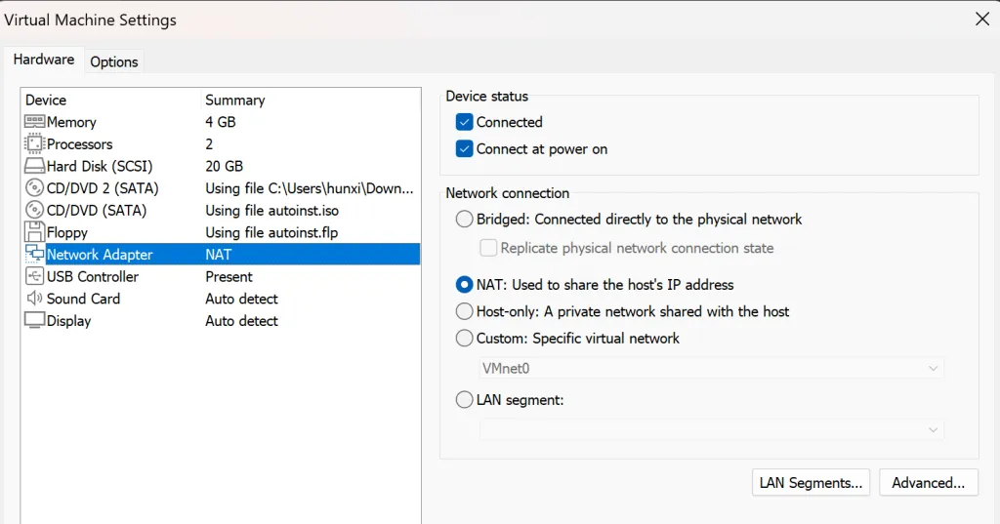
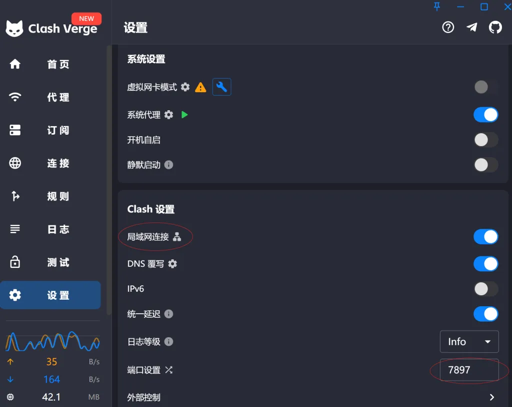
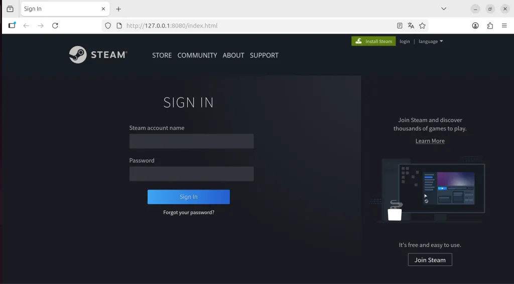
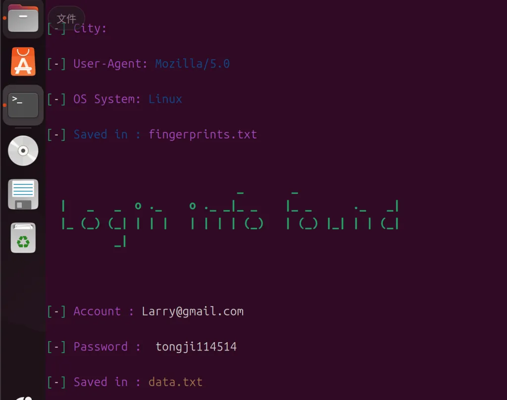
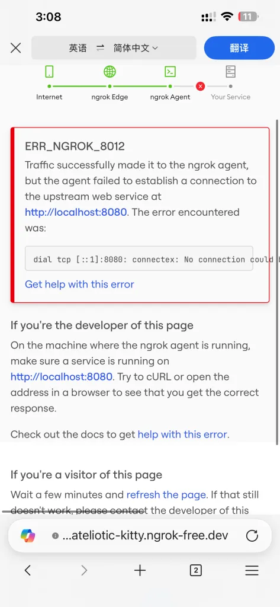

<figure>

<figcaption>

图片源自芳文社漫画《Slow loop!》

</figcaption>

</figure>

起因是我中午吃华莱士的时候看到一个网络安全的视频——传统印象里面的黑客都是把电脑接入服务器然后开始手指翻飞打代码，屏幕上有个侵入进度条慢慢往上涨。说实话这些影视作品都带有严重的幻想色彩和艺术美化，我手指翻飞的时候一般是写急眼了开始给Gemini发大段Prompt。

实际上，当前38%的互联网黑客攻击是伪装成商业邮件和短信的假网址，只要你在这些钓鱼页面上登陆，你的账号密码手机号验证码就会被交给黑客，到时候你就可以出演《无能的丈夫》里面的男二号了

视频中提到用mip22就可以做一个简单的钓鱼界面，并且接收任何在钓鱼界面上登陆的人的信息，完全是出于个人兴趣，我在接下来的课程上开始尝试用mip22的模板实现一个Phishing网页

先说结论，这期拉了，没成功

* * *

接下来是整个实际过程中的尝试与试错经历：

首先是在Linux下，克隆mip22的GitHub仓库，我用的是VMware下的ubuntu，这里遇到的第一个问题，也是一个非常重要的收获，在于我的虚拟机网络不会走我的主机代理，也就是我在Linux上被墙挡住了，访问GitHub会超时

VMware的默认模式是NAT模式(如下图)，NAT不会占用学校节点池子里面的真实节点，而是创建一个只能和宿主机相互交换的虚拟节点，互联网申请在外界看来都是由我的宿主机发出的，外界找不到我的虚拟机节点。

虚拟机不会共享宿主机的网络代理，原因比较多，但是基本上能归结于：由于虚拟机流量未经过宿主机应用层代理，不会被宿主机的网络代理劫持，也就不会通过代理进行发送

最开始我想到的解决方案是在虚拟机上下载我的代理客户端，让虚拟机网络也走代理，后来这个方案被一个更轻松的解决方案代替了，那就是让虚拟机把网络请求交给主机，让主机代为转发

实现这个方案首先需要打开宿主机代理客户端的”允许互联网连接(allow LAN)“选项，然后找到端口，我用的软件是Clash Verge，这两个选项都在Clash设置里面

然后找到虚拟机的ip地址，在Clash Verge里面点一下局域网连接旁边的小符号就能看见了

最后在Ubuntu里面直接输入：

git config --global http.proxy http://**_IP地址_**:**_端口号_**  
git config --global https.proxy http://**_IP地址_**:**_端口号_**

需要注意的是，最好在windows防火墙里面把自己的虚拟机加入到白名单，也就是在Windows Defender防火墙中放行特定端口，否则宿主机还是不接受它使用自己的互联网。我在这里用了一个简单粗暴的办法：

**我把宿主机专用网络和公用网络的防火墙都关掉了**

现在就能成功从Github仓库上克隆代码了，仓库地址：https://github.com › makdosx，说实话打开这个仓库的时候我就不抱什么成功的希望了，因为mip22的上次更新是在四年前，这年头技术迭代太快了，四周没更新的项目能不能用我都得掂量掂量。整个项目的使用方法很简单，而且也写在README.md里了，我很快就能做出一个本地的伪登陆界面(如下图)

非常好界面，使我输入自己的账号密码然后被卖掉所有饰品

对于一个钓鱼网站来说这足以以假乱真了

如果有人不幸在这里输入了自己的账号密码，这边能看到的效果展示如下

但是这个方案没法联网，联网需要ngrok实现内网穿透，但是ngrok对于这种方案的支持早就停止了，确切地说，现在ngrok看见这种一看就是骗子的url，会直接挡住访问请求。我注册了ngrok账号并且在Linux的配置里写入了自己的authtoken，也没找到解决的办法

<figure>

<figcaption>

这是我在手机上打开诈骗网页时显示的界面，我走的最远的路就到这里了

</figcaption>

</figure>

ngrok和其他的使用方案以及配置方法我还没搞明白，或许有解决问题的办法也说不定

顺带一提，我写这篇文章的时候，发现我的虚拟机网络炸了，在VMware里面Restore Default还原了虚拟网络的所有默认设置才把网络恢复过来

* * *

鼓捣了将近两个小时，做了点我觉得还算有意思的事情

课间的时候下节课的学生陆陆续续来了，我也就背着包离开了

走的时候我在门口的告示牌上看了一眼下节课的课程名：

**大学生安全教育**
