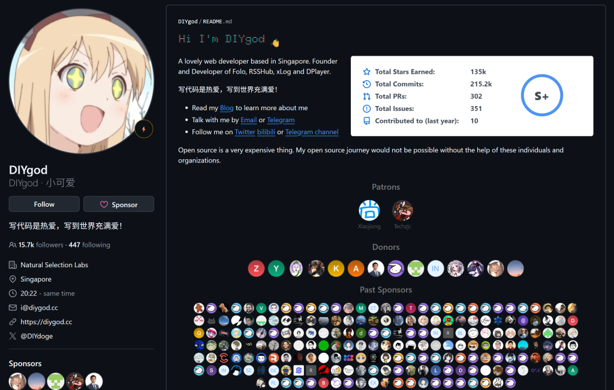
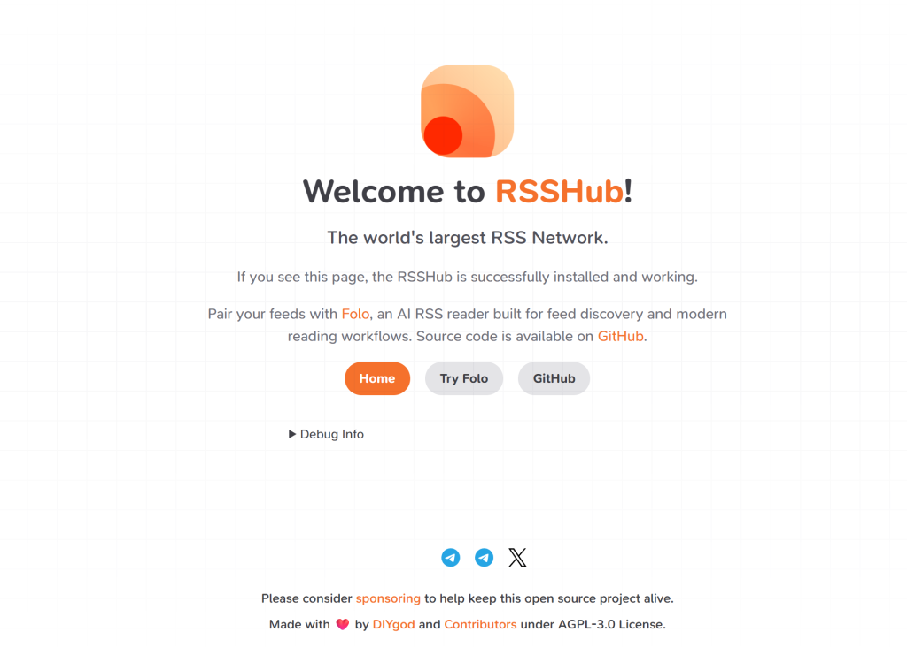
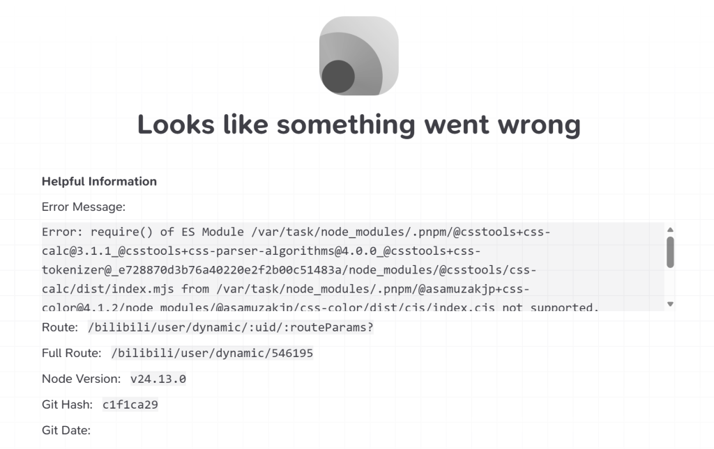
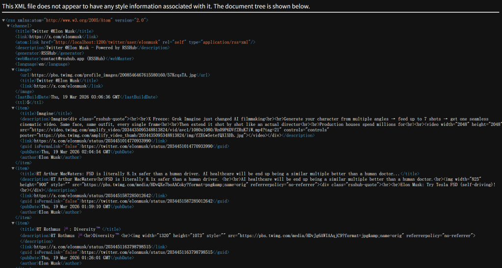
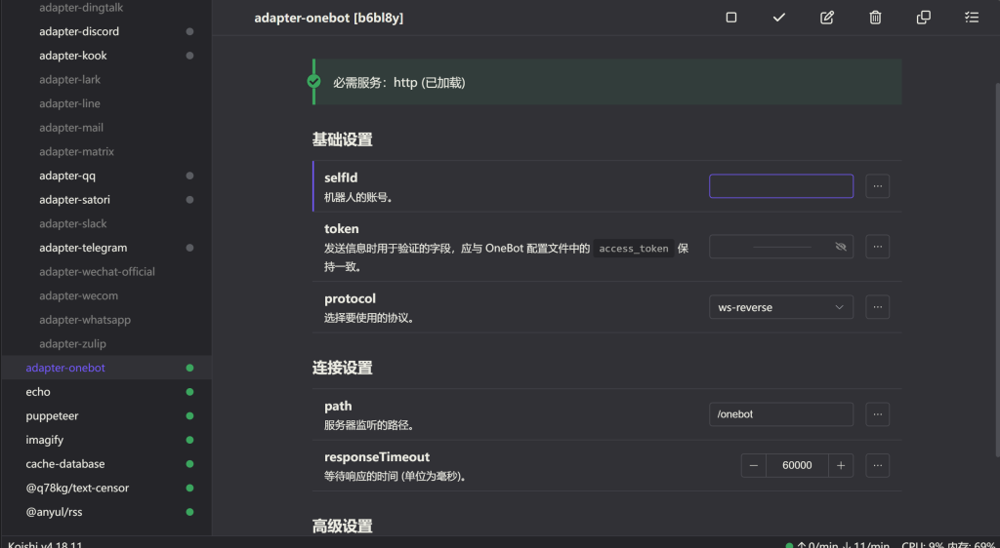
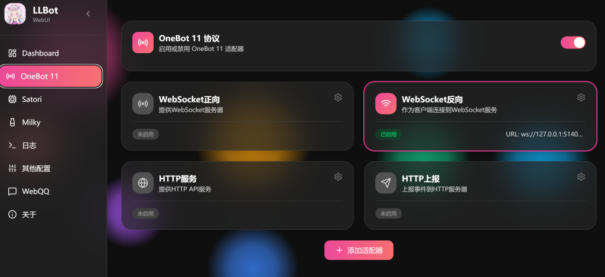
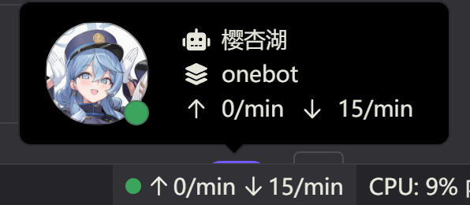
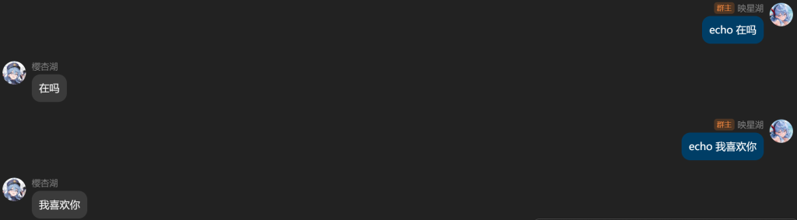

---

一次简单的rsshub与qq机器人尝试

---

<figure>


<figcaption>

图片出自没有第二季的轻改电影《游戏人生0》

</figcaption>

</figure>

本文旨在简述一个订阅特定推特账号，并且可以定时推送/手动获取最新推文的机器人实现方案。

使用的技术包括：RSSHub，LLOneBot和Koishi

* * *

### 为什么要做这个？

**为了娱乐服务**

我可以说，本博客的绝大部分文章，编写的原因都是我看到了一些好玩的东西然后打算自己实现一下

因为笔者就是这样的性格，我主要就是想做一些有意思的事情

实际上本文要介绍的这个操作过程不涉及底层代码编写，对于技术原理的介绍也仅仅是简单的基础内容，我就是记录一下自己是如何把这些现有的东西连接在一起的，如果有其他人想做类似的事情，或许可以提供一点帮助

* * *

### 如何配置RSSHub？

首先我们简单介绍一下RSS

RSS是一个可以让你订阅各种感兴趣的网站内容，并且第一时间获得推送的工具

举个简单的例子，如果你想关注B站某个up主，你可以一键三连加关注，这样以后这个up主发视频的时候你就可以第一时间收到通知，然后到前排吃热乎的

但是这样要面对两个操蛋的问题：

第一是平台消息推送，如果你想要获得up主的更新通知，就得打开B站的通知权限，就我个人而言我对垃圾消息的容忍度几乎为0，我希望每次手机有消息都是因为有一些要处理的正经事，而不是在各种各样莫名其妙的广告中翻找一条有用的信息


第二是信息推荐算法，很多时候我们可能只是想看自己关注的up最新视频，但是看到首页的推送就刷起来了，不知不觉就过了几个小时，最后甚至连本来想看的视频都忘了看

RSS能做到的，就是干净利落地获取订阅用户的最新内容，并且准确推送到你的阅读器上

但是RSS是反商业化的，导致它确确实实地被资本做局了。根据快乐互斥原理，大伙高兴了叔叔就不高兴了，用RSS直接获取平台内容，谁也不看广告，叔叔就赚不到钱。RSS的部分局限在于，RSS阅读器需要标准xml格式的RSS源，为了把用户留在自己的网站上，现在的主流平台都拒绝提供官方的RSS支持，只有学术、新闻和个人博客等平台会主动提供RSS源

《古兰经》中有句俗语：”山不到默罕默德那边去，默罕默德就到山的这边“。2018年，由中国程序工程师DIYgod发起的RSSHub项目解决了RSS源的短缺问题，RSSHub能做到的就是爬取网页内容，将其按照规则路由转化为标准xml格式，这样就能在各大主流网站上获取RSS的订阅链接

<figure>



<figcaption>

DIYgod的GitHub主页

</figcaption>

</figure>

RSSHub的代码库：[https://github.com/DIYgod/RSSHub](https://github.com/DIYgod/RSSHub)

如果想要一个可以长期使用的RSSHub，建议将其部署在Vercel云端

Vercel部署RSSHub的流程非常简单，先Fork一份代码到自己的仓库，然后登陆Vercel关联自己的GitHub账号，最后Import一键部署就行了

<figure>



<figcaption>

当你看到这个界面的时候，你的RSSHub就部署成功了

</figcaption>

</figure>

不过到这一步还没法立即使用，现在直接去爬RSS的话，大概率会看到下图



这是因为触发了官方平台的”未登陆访客限流“或反爬虫风控，需要把自己的身份认证(Auth Token / Cookie)配置到RSSHub

以B站为例，按F12打开开发者工具，切换到网络界面，随便找一个请求，然后在Request Headers里面找到自己的Cookie并复制下来，回到Vercel在Settings里面配置Environment Variables，很大程度上能解决这个问题。然而B站的反爬虫有点严格，只配置这些不一定能保证成功...

马斯克比叔叔好一点，推特对爬虫的打击可以说是放着不管，甚至把自己的账号密码配置进环境变量就能访问，爬推特的时候我们可以看到RSSHub的功能是如何实现的

<figure>



<figcaption>

Elon Musk的推特主页转化为xml格式后的成果

</figcaption>

</figure>

我个人鼓捣RSSHub的时候，做的是本地部署，如果各位对这个过程感兴趣可以往下看看，觉得这个行为没必要（实际上也没必要）的读者可以直接跳到下面的LLOneBot和Koishi章节了

我在本地部署里面选择了一种最吃力不讨好的方式，RSSHub是支持Docker Desktop安装的，但是我的电脑上有安装好的Node.js，所以我用npm开始自己拉包

首先根据自己的代理服务器端口，把网络代理配置好

_git config --global http.proxy http://127.0.0.1:代理端口  
git config --global https.proxy http://127.0.0.1:_代理端口_  
npm config set proxy http://127.0.0.1:_代理端口_  
npm config set https-proxy http://127.0.0.1:代理端口_

我最开始用_npm install -g rsshub_安装，这其实是一个致命的错误，RSSHub并不是一个可以用缩写命令启动的普通软件工具，本质上它是一个完整的“网站服务器代码”，就算把所有的依赖包都安装好，也没有办法一键启动

正确的方法是：

```
1. git clone --depth 1 https://github.com/DIYgod/RSSHub.git 
# 这一步是把RSSHub的整个源码克隆到本地，前面的参数是仅下载最新源码，不理会历史记录

2. cd RSSHub

3. npm install --legacy-peer-deps
# --legacy-peer-deps 参数是为了无视依赖树冲突产生的报错（不影响使用）

4. npm run build
# 超级拼装

5. npm run dev
# 这里也有一个问题，run dev启用的是开发者模式，如果上一步的run build成功生成了预编译好的 routes.json文件，用npm start应该也能成功启动
# 我对于这部分内容实际一知半解，如有问题欢迎斧正
```

<figure>


<figcaption>

看到RSSHub源码的npm be like：

</figcaption>

</figure>

RSSHub默认的本地端口是[http://localhost:1200](http://localhost:1200)，在浏览器中输入，看到Welcome to RSSHub的界面，就说明本地配置成功了，之后有本地配置proxy和authtoken的步骤，比较简单，在此不再赘述

* * *

### 如何配置LLOneBot和Koishi？

LLOneBot官网：[什么是 LLBot | 幸运莉莉娅](https://www.llonebot.com/guide/introduction)

Koishi官网：[Koishi](https://koishi.chat/zh-CN/)

简单介绍一下二位，LLOneBot是一个基于NTQQ框架的协议适配器，Koishi是一个多平台的机器人框架，前者负责从QQ抓取消息并传输，后者负责对信息进行处理

这两个的下载安装相对而言就简单得多，跟着官网教程一步步走就可以了，这里主要讲一下将二者进行连接的过程

首先对于Koishi，需要下载插件市场里面提供OneBot支持的插件adapter-onebot，下载之后会看到下图的界面



机器人账号填写要当作机器人的QQ号（建议使用小号），token保持无填充就可以，协议选择ws-reverse，这个的意思是Koishi作为服务端等待OneBot传输消息，是相对主流的方案。path里面有一个自动填充的/onebot，不用修改

然后打开LLOneBot的OneBot协议界面：



启用WebSocket反向，不要启动其他的东西，这样协议才会保持一致，连接地址填写ws://127.0.0.1:5140/onebot，这里的5140是Koishi的默认本地端口，/onebot就是Koishi里面的path，如果连接成功，Koishi右下角的QQ账号会显示一个小绿点



我们可以安装一个简单的插件测试一下，比如echo插件，可以让机器人复读你发过去的一句话

<figure>



<figcaption>

ok表白成功了嗷兄弟们

</figcaption>

</figure>

如果机器人对指令有反应，说明机器人框架的监听和处理已经连接上了

当然这还不够，我们的最终目的是实现RSS订阅和阅读，这需要另外一个Koishi插件**@anyul/rss \[yvgh2r\]**，这个插件对于RSS的支持算是相当优秀

安装好插件之后，可以使用help rssowl查看指令用法，几个简要而实用的功能如下：

`rsso <url>` 获取订阅连接

`rsso.list` 获取订阅列表

`rsso.pull <序列数>` 获取最新内容

现在你可以订阅自己喜欢的网页，并且用pull获取最新的更新了

* * *

### 还存在什么问题？

马斯克对RSS的态度还算友好，麻花疼对OneBot的态度并不友好。只要还在使用OneBot插件，就会时不时地被检测然后被踢下线，具体的处罚机制我还没有触碰到，现在只是在被踢之后要手动重新登陆

RSSHub可以部署在云端，但是我在这里把机器人框架部署在了本地，这意味着只要我的电脑进入休眠或关机，机器人就会嘎的一下嗝屁，不能24小时使用

* * *

### 一些有趣的事实

- 写出RSSHub的大佬DIYgod曾经在B站任职前端工作，现在已经跑路，目前住址在新加坡。除了RSSHub外，主流网页视频播放器Dplayer也是他的开源项目贡献

- DIYgod是RSS重度用户，最开始就是想订阅几个微博账号，后来又在B站、知乎上订阅，为了方便RSS的使用写出了RSSHub，此时天下苦秦久矣，于是一呼百应，成千上万的人参与了RSSHub的路由编写，这种众人拾柴火焰高的团结壮举是开源项目的魅力之一

- RSS的使用仍然需要和平台斗智斗勇，RSSHub的运作本质上是在各家平台的围墙上钻洞获取信息。由于平台投入了海量的研发资金来修补围墙，RSSHub的很多路由（尤其是商业化严重的社交平台）经常会失效，需要开发者不断去更新代码应对。俗话说的好，与人斗，其乐无穷

- Koishi的rss插件，序列号如果是1，那么就可以直接把rsso.pull的参数写成1，我在astrbot上使用rss插件的时候，序列号如果是1，参数要写成0。开发者可能是在致敬数组下标从0开始的逻辑，我去你的

- Koishi有很多非常有意思的插件，除了经典的随机群老婆，今日塔罗牌之外，还支持舞萌分数查询，steam在线查询，bot好感度系统等等，有兴趣的读者可以自己去探索。不过使用频率越高被查封的风险就越大，这方面的度量请自行把握

- 实际上这个机器人不是特别好用，因为pull只能获取最新的推文，而且包括此推主转发的推文，这就意味着你如果不知道推主转发了什么，pull下来的东西可能并不是你想要的，我是不会告诉你们机器人在鸣潮群里面发了原神图片的

- （补充↑）如果想让机器人只转发原创推文，可以进行RSS设置

- 特别鸣谢 @Czz 对本篇文章技术路线的指点
