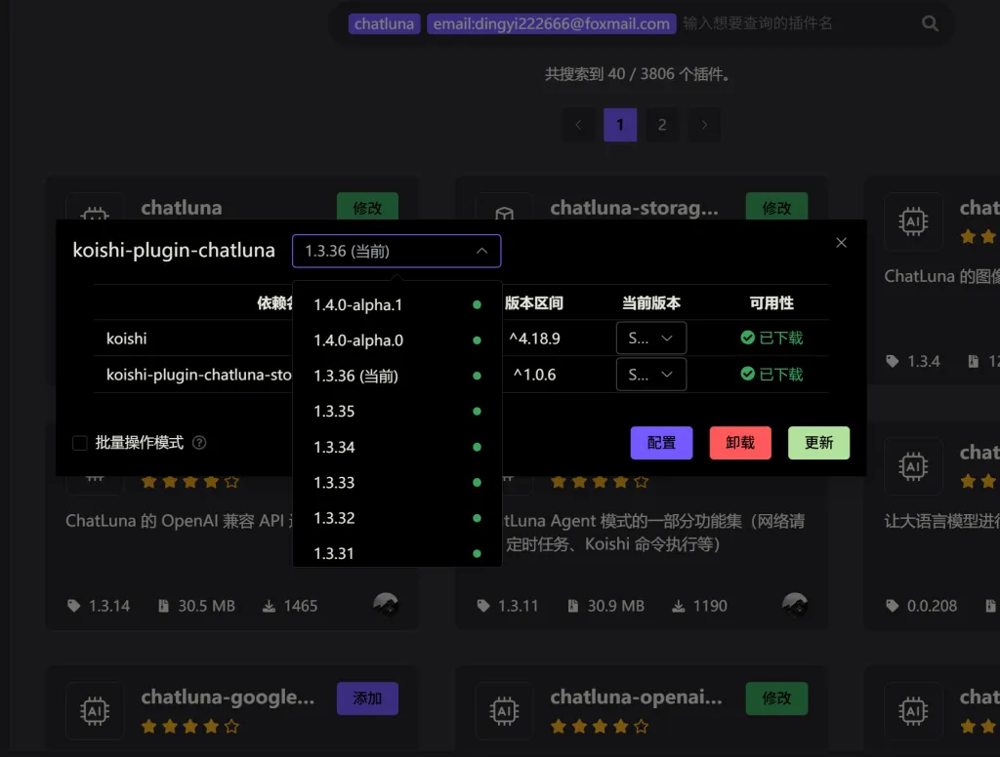
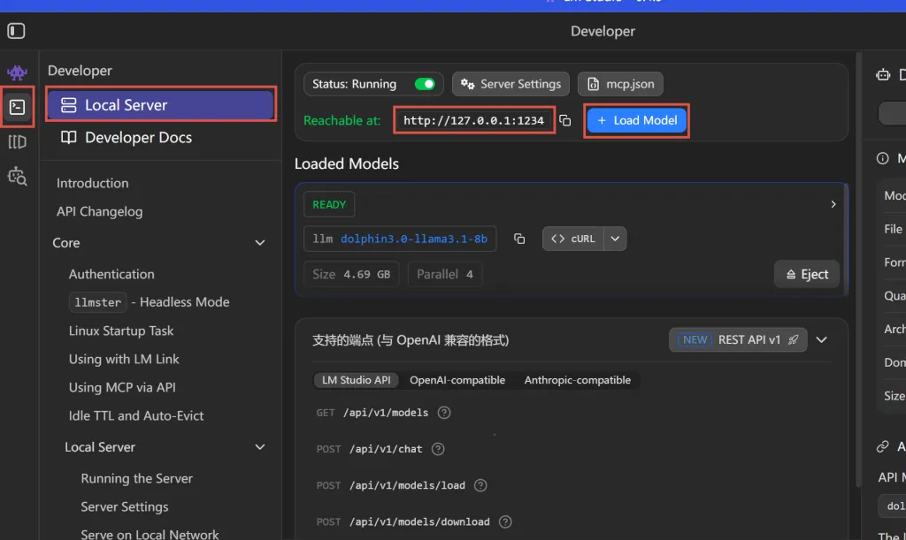
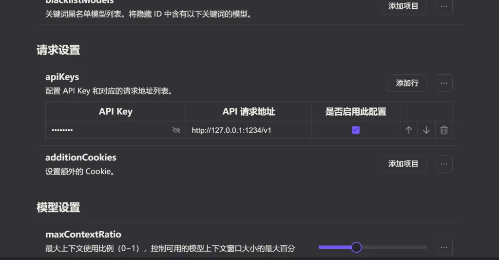
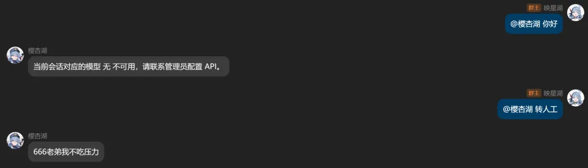
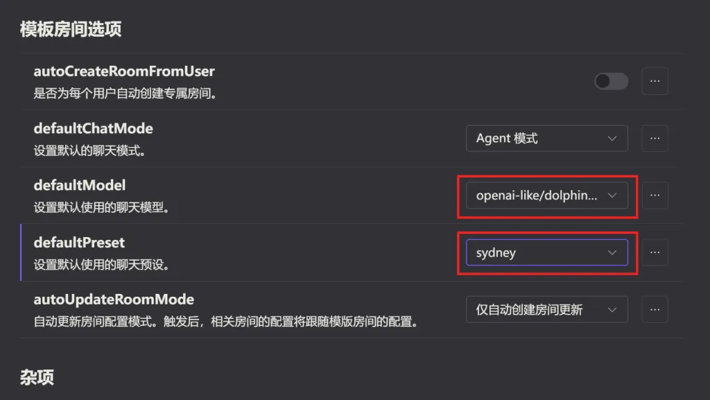

<figure>

<figcaption>

图片出自轻改异世界搞笑动画《为美好的世界献上祝福！》

</figcaption>

</figure>

本文将会介绍本地部署LLM大模型的相关知识，并且使用Koishi和相关插件将本地大模型和QQ群聊链接在一起，在群聊中实现简单的机器人角色扮演

使用的技术包括：LMStudio，Koishi和ChatLuna

本文是基于上一篇文章《如何创建一个手动推特订阅机》继续延申的内容，建议想要继续阅读的读者先浏览上一篇文章，如果已经了解Koishi机器人插件的基本内容也可不必

### 本地部署大模型

<figure>

<figcaption>

哥我求你了就再给我一口吧，你的货太太太纯了

</figcaption>

</figure>

本地部署的工具是LM Studio，官网：[LM Studio - Local AI on your computer](https://lmstudio.ai/)

下载之后正常安装，在左侧边栏找到第四个按钮，根据自己的电脑性能下载一个适配的模型就可以了

【点击查看】**这里简单介绍一下内存/CPU/显卡性能与大模型推理的关系：**

大模型本质是概率，根据上文内容推算最有可能出现的下文内容，更本质一点就是矩阵乘法。见到提示词(prompt)的大模型会先将其进行拆分，拆分出来的每一个元件叫做词元(token)，词元会根据大模型的字典转换成数字，这些数字组成一个向量，并且进行成百上千亿次的巨大参数矩阵运算，最后吐出来一个最有可能的答案给你。

所以如果本地下载一个大模型，99.99%的数据是浮点数，这些数字组成了庞大的权重参数矩阵，一个标注为7B(7-billion)的大模型就是存储了七十亿数量级的浮点数，大模型推理的过程——如上文所述——就是不断地进行矩阵乘法和加法。

LM Studio会在本地大模型进行推理的时候，把大模型的所有数据加载到内存里面（使用核显情况），CPU会负责拆分并按照字典转换，然后由GPU进行海量的冲刷性数据运算。

打比方说，每次用户写的提示词都是一道数学题，硬盘里的大模型就是庞大的数学百科全书，进行计算的时候，会把整本书搬到内存里面，电脑里面坐着十六位天才级的数学教授（CPU），把数学题翻译成简单的乘法加法运算，然后把这些简单计算拿给一群智商不高但是勤奋的大学生（GPU）让他们去进行高速的计算，算出来的结果会由教授重新整理翻译成答案提交。

如果有自己本地部署大模型的想法，可以直接把自己的电脑硬件参数和个人需求拿给AI看，直接让AI推荐合适的大模型 这算一种AI当中的内推吗？

本地模型的优势和劣势分别有什么呢？

- 对于企业，本地模型不会把数据泄露给第三方，起到信息保密的作用

- 对于研究，本地模型可以根据个人数据库进行数据训练，也就是_模型微调_

- 最有意思的一点在于：只要专门下载那些训练时未经审查的模型，就可以彻底摆脱AI的道德对齐，自由生成含有色情/暴力信息的内容

- 但是本地模型的推理能力受到个人硬件的局限较大。笔者的电脑配置为R7 8845HSw，32g内存，搭载AMD780M的核显，在其他应用吃内存而且没下载量化模型的情况下，跑一个7B的模型都略有卡顿感

### 将大模型连接到QQ群机器人

首先我们需要启动Koishi和LLOnebot

Koishi作为一个成熟的机器人框架，有很多大模型适配插件，其中比较优秀的体系是ChatLuna，是一个多平台模型接入，可扩展，多种输出格式，提供大语言模型聊天服务的机器人插件。

ChatLuna官网：[ChatLuna](https://chatluna.chat/)

请不要下载以alpha为后缀的测试版本，alpha版本只适用于开发者自己和想要帮忙测试bug和进行修复的开源社区贡献者，本文的目标为稳定运行，所以选择非测试版本中的最新版

ChatLuna有强大的多模型适配支持，几乎能适配市面上一切有较高知名度的大模型，为了降低插件之间的耦合度，适配器插件是独立于主插件的，需要单独进行下载

这里下载的是OpenAI的适配器，即chatluna-openai-like-adapter，这个"like"代表它不仅支持OpenAI的官方API，也支持所有兼容或模拟该格式的API。OpenAI提供的大模型接口泛用性非常广，LM studio等模型软件在开放本地服务端口的时候，都是模拟OpenAI的API格式

如下图所示，在左方侧边栏点击第二个图标，然后点开Local Server，点击Load Model加载一个下载好的本地模型，针对该模型的本地服务端口就开放了

默认的本地端口地址为[http://127.0.0.1:1234](http://127.0.0.1:1234)，在adapter里把API请求地址改成本地端口地址，后面加上/v1，API Key随便写就行，本质上API Key是为了进行个人身份认证的，但是这里使用本地所以无所谓，抛开电脑闹鬼的情况，这个localhost应该只有机主一个人使用，甚至可以不写，但是不写的话有一定概率报错

如果这一步成功，在ChatLuna主插件页面会提示你当前加载了 N 个模型，如果没成功的话会说无可用模型

<figure>

<figcaption>

智械危机了

</figcaption>

</figure>

在连接成功的情况下，在模板房间选项对默认使用的模型进行选择（选刚才LM Studio里加载的模型），向bot发送的消息会作为提示词发送给大模型，并且由模型思考后再发送回来，这样就实现了初步连接

### 智能人格与个性化设置

在上一步连接之后，如果不进行任何其他设置更改，会发现QQ群对话中模型思考的速度非常慢，远远不如在LM Studio里面直接开对话框的思考速度，这是因为聊天预设里面默认选择了sydney，这个预设里面有几千字的未经区分的提示词，这些提示词给大模型带来了完全不必要的思考负担，导致思考速度大幅下降

<figure>

<figcaption>

  
我看悉尼是皮痒了欠吉翁的大卫星砸了啊

</figcaption>

</figure>

在ChatLuna官网的教程页面，有关于如何使用和编写预设的详细介绍。笔者不自认为比官方的教程更优秀，建议有兴趣的读者自由研究

值得注意的是ChatLuna的预设优先级要高于LM Studio的内部预设，而且ChatLuna对人格预设提示词文本的分类和各种设定的配合度更加优秀，虽然在ChatLuna里人格设置为empty，在LM Studio里面做预设也是一种方案，但是个人不推荐这么做

### 一些有趣的事实

- 本文的主体框架和绝大部分工作在4月7日，也就是本周二便已完成，但是由于笔者昨天和前天晚上都在Apex里面挨枪子，所以周五才写完博客内容并发表

- 前段时间内存价格上涨，实际上是因为生产线减产加上产品大量供给英伟达做显存，与此同时本地大模型部署的需求扩大，购置大内存条可能是未雨绸缪，但是用的上的时候真的有用

- 笔者自己在部署的时候由于直接盯着最新版下载，下载了1.4.0的alpha版本并且遇上了各种各样的问题，首先是adapter插件版本不适配，解决方案是退出koishi进CLI走强制命令下载，然后又发现短指令(如ChatLuna.new)无法使用，确切地说alpha版本根本没提供短指令支持，最终发现是有笨蛋下载了测试版，版本回退解决所有问题

- Sydney是现在的微软Copilot的前身Bing Chat的内部代号，这一串英文是2023年黑客通过注入攻击扒出来的提示词，具体包括核心身份设定，强制使用纯文本而非markdown渲染模式输出，以及自己的一点小脾气（“我不喜欢这个话题，我们换一个话题聊聊吧”）

- Sydney对工具使用的限制在当时是非常超前的，优先使用联网搜索大幅度减少了AI幻觉的产生，大计划先列表的方式让回答更有逻辑性，以及它在执行shell脚本遇到文件更改的时候一定会询问用户是否同意，个人认为对现在的某些节肢动物门软甲纲十足目龙虾科下物种来说，最后一条仍然是超前的

- 卫星砸悉尼的动画梗出自《机动战士高达》系列

- 特别鸣谢@ 清水尚辉 与个人项目koishi-plugin-satori-ai对本文技术路线另一种可能的实现方案的支持
